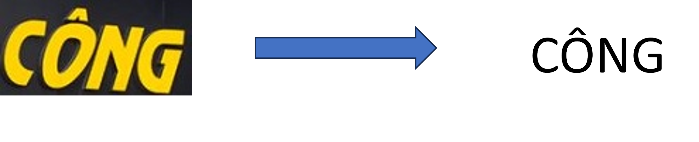
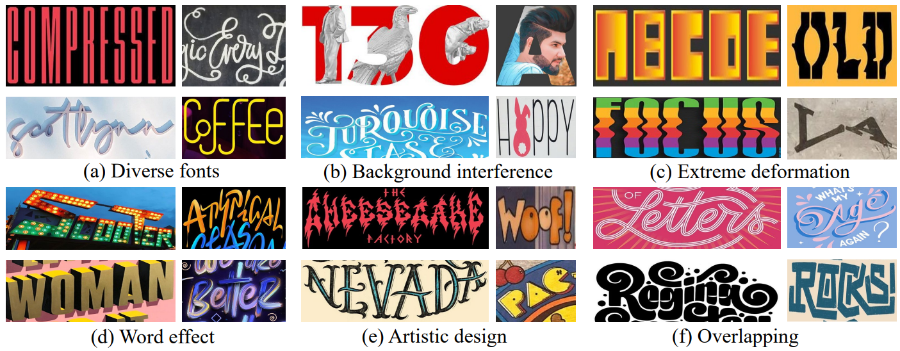
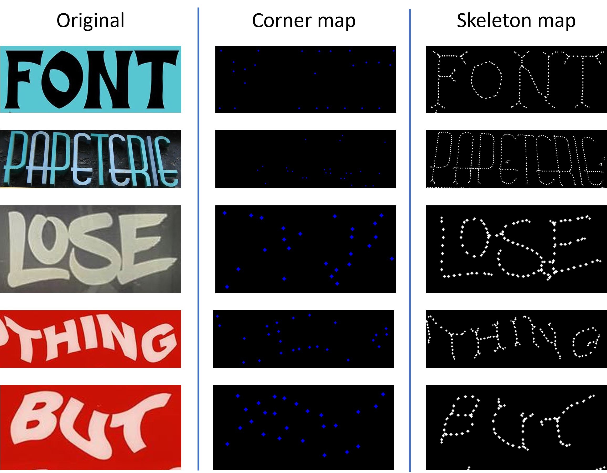
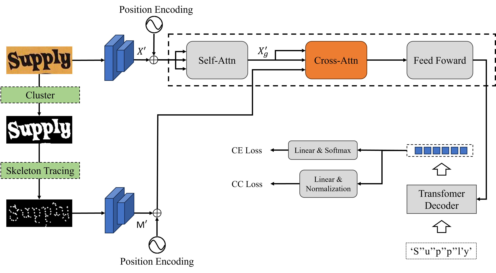
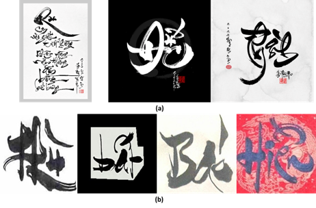
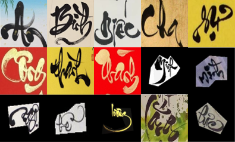

# GraduateThesis

We are students from University of Information Technology - a member school of Vietnam National University

This is our Graduate Thesis

[Vietnamese PDF](KLTN_2023_Finish_1.pdf)

## Problem

Writing has played a significant role in human history, serving as a vital tool for transmitting information, knowledge, and experiences to future generations. In the digital age, the demand for detecting and recognizing text in images and videos has led to the development of Scene Text Recognition (STR), attracting considerable interest from the research community.

- Input: Photos containing text to be recognized
- Output: Nội dung văn bản trong ảnh

    <i>Left is Input, Right is Output</i>

Although there are many advanced methods in regular Scene Text Recogniton, <b>artistic texts regconition problem</b> recently gotten a lot of attention from researcher. These texts are characterized not just by their informational content but by their style, structure, and the emotional or intellectual impact they are intended to convey. Identifying artistic texts is a complex task that goes beyond simple text recognition, requiring an understanding of context, style, and the creative intent behind the text.

[WordArt database](https://arxiv.org/abs/2208.00438#)

## Approach

We use Skeleton map different from the [Baseline](https://arxiv.org/abs/2208.00438#) - Corner map

Corner bitmap extract information of egdes in the image, but we create another approach that is extracting the stucture information of text in image

    </img>

Skeleton Guided Transformer Architecture

    </img>

For extracting skeleton map, we use [Ling Dong's repository](https://github.com/LingDong-/skeleton-tracing)

## Data

Because of the lack of artistic text data in Vietnamese, we decided to extend the data source by collecting images which are contain Vietnamese Calligraphy text called ViCalligraphy dataset.

 - Collected images

 - Images in dataset

<!-- Data is available in this [link](https://) -->

We also use more datasets in the experiment
which are 
- BKAI (Vietnamese)

- [ICDAR2013](https://ieeexplore.ieee.org/document/6628859)

- [WordArt](https://arxiv.org/abs/2208.00438#)

- [Vintext (Vietnamese)](https://openaccess.thecvf.com/content/CVPR2021/papers/Nguyen_Dictionary-Guided_Scene_Text_Recognition_CVPR_2021_paper.pdf)

- [TotalText](https://arxiv.org/abs/1710.10400v1)

- [CUTE80](https://www.semanticscholar.org/paper/A-robust-arbitrary-text-detection-system-for-scene-Risnumawan-Shivakumara/4077447a36920c6805387bbf25948d09180b6b17)

- VietSignBoard (Vietnamese)

In total, there are 11822 artistic text images and 73873 non-artistic text images. Those datasets conbined in one large dataset call VNArtText

## Experiments

In experment state, we used [ViTSTR](https://arxiv.org/abs/2105.08582), [SATRN](https://arxiv.org/abs/1910.04396), [Corner Transformer](https://arxiv.org/abs/2208.00438#), [ABINet](https://arxiv.org/abs/2103.06495), [PARSeq](https://arxiv.org/abs/2207.06966) for training and evaluating on CER and Accuracy.

1. Conpare with Corner Transformer

Specifically, we divided the artwork in the VNArtText dataset into two volumes, a training set of 12475 images and a test set of 4152 images. Next, we train two models with 20 epochs and get the results shown in the table

| Method | Accuracy (\%) | CER |
|--------|---------------|-----|
| Corner Transformer | <b>0.67</b> | 1.0003|
| Skeleton-Guided | 0.75 | <b>0.9859</b> |

2. Using pretrained weight of all method

In this experient we used pretrained model to train on synthetic data [MJSythn](https://arxiv.org/abs/1406.2227) and [SynthText](https://arxiv.org/abs/1604.06646) of the text recognition and training problem add 20 epochs on the artwork in the VNArtText dataset (similar to
prior experiment). Skeleton Guided Transformer (Our) will take the pretrained weight of its [baseline](https://arxiv.org/abs/2208.00438#)

    <b><i>Accuracy Metrics</i></b>

| Method | BKAI | CUTE | IC13 | Vintext | Total | VietSignBoard | WordArt | All |
|--------|------|------|------|---------|-------|---------------|---------|-----|
| ABINet  | 55.06 |	75.00 |	73.31 |	44.34 |	57.04 |	50.72 |	65.85 |	58.09 |
| Corner Transformer  | <b>79.17</b> |	79.31 |	82.87 |	<b>71.15</b> |	<b>73.85</b> |	73.68 |	<b>71.14</b> | <b>73.31</b> |
| SATRN  | 74.40 |	80.00 |	81.67 |	67.57 |	61.06 |	72.25 |	67.77 |	68.55 |
| PARSeq  | 75.30 |	78.45 |	81.67 |	67.38 |	66.24 |	<b>75.12</b> |	69.69 |	70.23 |
| ViTSTR  | 59.52 |	58.62 |	63.75 |	46.27 |	43.82 |	48.80 |	53.28 |	51.01 |
| Skeleton-Guided  | 70.54 | <b>80.17</b> |	<b>84.46</b> |	59.83 |	72.84 |	62.68 |	70.95 |	69.12 |

----------------------------------------------------------

    <b><i>CER Metrics</i></b>

| Method | BKAI | CUTE | IC13 | Vintext | Total | VietSignBoard | WordArt | All |
|--------|------|------|------|---------|-------|---------------|---------|-----|
| ABINet |  0.138| 0.169| 0.101| 0.200| 0.189| 0.170| 0.144| 0.163 |
| Corner Transformer |   <b>0.077</b>| 0.147| 0.070| 0.118| 0.109| 0.129| 0.130|  <b>0.116</b>  |
| SATRN |  0.085| 0.146| 0.065|  <b>0.117</b>| 0.174| 0.108| 0.134| 0.130 |
| PARSeq |  0.096| 0.147| 0.080| 0.131| 0.164|  <b>0.096</b>| 0.126| 0.129 |
| ViTSTR |  0.149| 0.245| 0.148| 0.220| 0.320| 0.217| 0.220| 0.232 |
| Skeleton-Guided |  0.089|  <b>0.145</b>|  <b>0.062</b>| 0.148|  <b>0.101</b>| 0.158|  <b>0.125</b>| 0.120 |

3. Without pretrained weight

All model trained on data that does not contain art and evaluation on a dataset that only includes art text will allow us to accurately evaluate the invariance of the model for changes in data distribution, when art words are often very different from normal words.

    <b><i>Evaluate on 11822 artistic text images of VNArtText</i></b>

| Method | Accuracy (\%) | CER |
|--------|---------------|-----|
| ABINet | 52.01 | 0.2962 | 
| Corner Transformer | 48.33 | 0.3598 | 
| SATRN | 44.69 | 0.3939 | 
| PARSeq | <b>58.43</b> | <b>0.2558</b> | 
| ViTSTR | 31.94 | 0.5189 | 
| Skeleton-Guided (Our) | 43.60 | 0.494|

    <b><i>Evaluate on ViCalligraphy</i></b>

| Method | Accuracy (\%) | CER |
|--------|---------------|-----|
| ABINet | <b>3.09</b> | <b>0.9083</b> |
| Corner Transformer | 1.16 | 1.0311 |
| SATRN | 1.06 | 1.0782 |
| PARSeq | 2.12 | 1.0129 |
| ViTSTR | 0.10 | 0.9795 |
| Skeleton-Guided (Our) | 1.16 | 1.3787 |